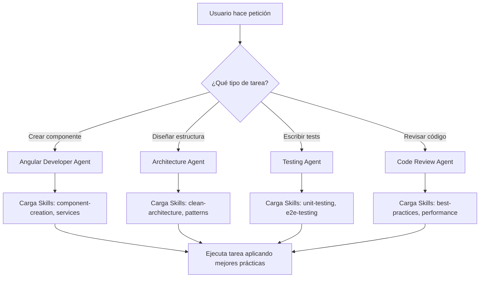

# 🚀 Guía de Uso del Sistema de Agents y Skills

## 📖 Introducción

Este sistema permite a Claude trabajar de manera más estructurada y autónoma mediante la definición de:

- **Agents**: Roles especializados con responsabilidades claras
- **Skills**: Conocimientos y patrones específicos que los agents aplican

## 🎯 Cómo Funciona

### 1. Estructura de una Tarea



## 💡 Uso Práctico

### Ejemplo 1: Crear un Componente

**Usuario dice:**  
"Necesito un componente de perfil de usuario que muestre nombre, email y avatar"

**Claude activa:**

- **Agent**: Angular Developer
- **Skills**:
  - `angular/component-creation`
  - `angular/services`
  - `core/typescript-advanced`

**Resultado:**

- Componente standalone con signals
- OnPush change detection
- Template con nueva sintaxis (@if, @for)
- Archivo de test creado
- Siguiendo todas las convenciones

### Ejemplo 2: Diseñar Arquitectura de Feature

**Usuario dice:**  
"Voy a crear un módulo de gestión de productos, ¿cómo lo estructuro?"

**Claude activa:**

- **Agent**: Architecture Agent
- **Skills**:
  - `architecture/clean-architecture`
  - `architecture/modular-design`
  - `architecture/solid-principles`

**Resultado:**

- Estructura de carpetas por capas
- Definición de entities, use cases, repositories
- Diagramas de arquitectura
- Documentación de decisiones

### Ejemplo 3: Revisar Código

**Usuario dice:**  
"Revisa este componente y sugiere mejoras"

**Claude activa:**

- **Agent**: Code Review Agent
- **Skills**:
  - `angular/best-practices`
  - `core/performance`
  - `core/security`

**Resultado:**

- Lista de issues encontrados
- Sugerencias específicas con código
- Priorización de cambios
- Explicación de cada mejora

## 📝 Comandos Útiles

### Activar un Agent Específico

```
"Usa el Angular Developer Agent para crear..."
"Como Architecture Agent, diseña..."
"Actúa como Testing Agent y crea tests para..."
```

### Aplicar una Skill Específica

```
"Aplica la skill de component-creation para..."
"Siguiendo la skill de clean-architecture, organiza..."
"Usa la skill de unit-testing para verificar..."
```

### Combinar Agents y Skills

```
"Como Angular Developer, usando las skills de
component-creation y state-management, crea un
dashboard con gestión de estado local"
```

## 🔧 Personalización

### Agregar Nuevas Skills

1. Crea un archivo `.md` en la carpeta apropiada:
   - `skills/angular/` para skills de Angular
   - `skills/architecture/` para arquitectura
   - `skills/testing/` para testing
   - `skills/core/` para skills generales

2. Usa el template en `skills/_template-skill.md`

3. Actualiza `config/skill-registry.json`:

```json
{
  "skills": {
    "angular/nueva-skill": {
      "file": "nueva-skill.md",
      "status": "active",
      "priority": "high",
      "description": "Descripción de la skill"
    }
  }
}
```

### Agregar Nuevos Agents

1. Actualiza `config/agent-config.json`:

```json
{
  "agents": {
    "nuevo-agent": {
      "id": "nuevo-001",
      "name": "Nuevo Agent",
      "role": "rol-especifico",
      "skills": ["lista-de-skills"],
      "responsibilities": ["Lista de responsabilidades"]
    }
  }
}
```

## 🎓 Mejores Prácticas

### 1. Ser Específico

✅ "Crea un componente standalone con signals para mostrar una lista de usuarios"  
❌ "Crea un componente de usuarios"

### 2. Mencionar el Contexto

✅ "Usando Clean Architecture, crea el repository para productos"  
❌ "Crea un repository"

### 3. Solicitar Revisiones

✅ "Revisa este código y verifica que siga las skills de Angular"  
❌ "¿Está bien este código?"

### 4. Pedir Explicaciones

✅ "Explica por qué usaste signals en lugar de observables"  
❌ "¿Por qué lo hiciste así?"

## 📊 Flujo de Trabajo Recomendado

```
1. Definir Arquitectura
   └─> Architecture Agent + clean-architecture skill

2. Crear Estructura Base
   └─> Angular Developer Agent + component-creation skill

3. Implementar Features
   └─> Angular Developer Agent + múltiples skills

4. Escribir Tests
   └─> Testing Agent + testing skills

5. Code Review
   └─> Code Review Agent + todas las skills relevantes

6. Optimización
   └─> Múltiples agents según necesidad
```

## 🔍 Verificación de Calidad

Al completar una tarea, Claude verifica:

- ✅ Se aplicaron las skills relevantes
- ✅ Se siguieron las responsabilidades del agent
- ✅ Se cumplieron las constraints definidas
- ✅ El código sigue las mejores prácticas
- ✅ La documentación es clara

## 🆘 Resolución de Problemas

### Claude no aplica una skill

**Solución**: Menciona explícitamente la skill:

```
"Usando la skill de component-creation, crea..."
```

### El código no sigue las convenciones

**Solución**: Solicita una revisión:

```
"Revisa este código con el Code Review Agent y
verifica que cumpla todas las skills de Angular"
```

### Necesitas una skill que no existe

**Solución**:

1. Solicita su creación:
   ```
   "Crea una skill para [tema específico] siguiendo
   el template de skills"
   ```
2. Claude la creará y la documentará
3. Actualiza el registry

## 📚 Recursos Adicionales

- Ver `/agents/README.md` para detalles de agents
- Ver `/skills/README.md` para catálogo de skills
- Ver `/skills/_template-skill.md` para crear nuevas skills
- Ver `/config/agent-config.json` para configuración de agents
- Ver `/config/skill-registry.json` para registro de skills

## 🎉 Próximos Pasos

1. Revisa las skills existentes en `/skills/`
2. Familiarízate con los agents disponibles
3. Comienza a hacer peticiones específicas
4. Agrega tus propias skills según tus necesidades
5. Personaliza los agents para tu flujo de trabajo
